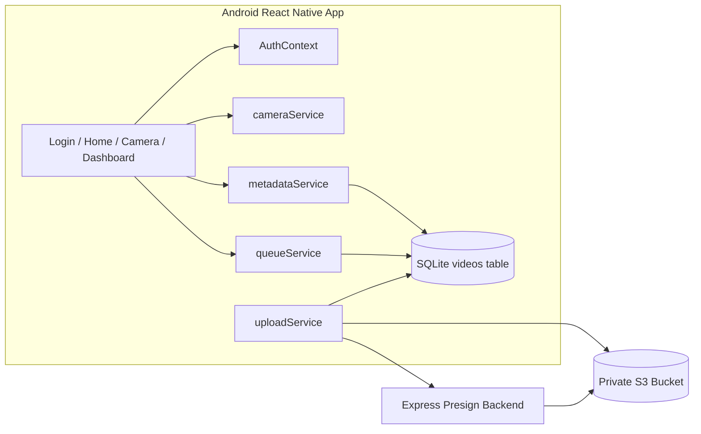
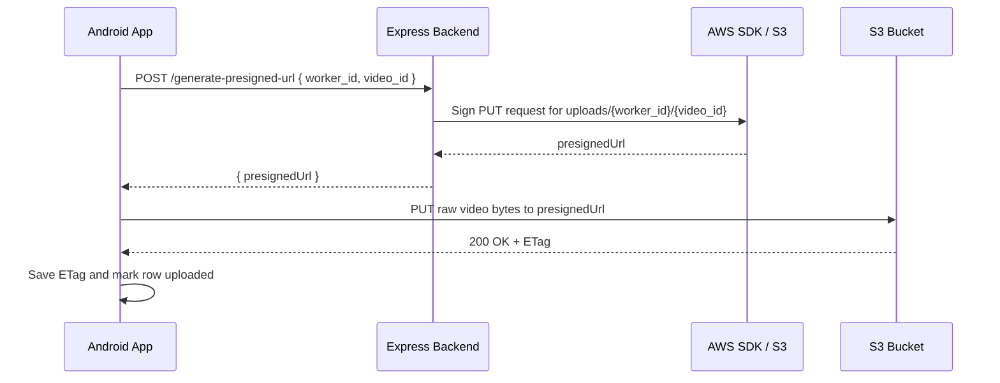

# Infrastructure Design

This document describes the production-oriented architecture for the Android video capture app, its local SQLite queue, and the backend presigned URL service.

## System Architecture



## Database Schema

The app stores video state locally in SQLite to survive app restarts and offline periods.

```sql
CREATE TABLE IF NOT EXISTS videos (
  video_id TEXT PRIMARY KEY,
  worker_id TEXT,
  started_at TEXT,
  ended_at TEXT,
  duration_ms INTEGER,
  file_size_bytes INTEGER,
  fps REAL,
  fps_tier TEXT,
  device_model TEXT,
  os_version TEXT,
  resolution TEXT,
  local_path TEXT,
  etag TEXT,
  metadata TEXT,
  upload_state TEXT,
  attempt_count INTEGER,
  last_error TEXT,
  last_attempted_at TEXT
);
```

### Column Notes

| Column | Purpose |
| --- | --- |
| `video_id` | UUID v4 idempotency key and primary key |
| `worker_id` | Logical user/worker identifier |
| `started_at` / `ended_at` | Recording timestamps |
| `duration_ms` | Clip length in milliseconds |
| `file_size_bytes` | Actual local file size |
| `fps` / `fps_tier` | Recording quality metadata |
| `device_model` / `os_version` | Device fingerprinting for diagnostics |
| `resolution` | Captured resolution string |
| `local_path` | Local file path used for upload and deletion |
| `etag` | S3 object ETag captured after successful upload |
| `metadata` | JSON blob for bonus metadata |
| `upload_state` | `pending`, `uploading`, `uploaded`, or `failed` |
| `attempt_count` | Retry counter |
| `last_error` | Human-readable upload failure reason |
| `last_attempted_at` | Last upload attempt timestamp |

## Index Justification

| Index | Why It Exists |
| --- | --- |
| `idx_videos_upload_state` | Queue processing and dashboard filtering repeatedly scan `pending`, `uploading`, and `failed` rows |
| `idx_videos_worker_id` | Supports worker-scoped views, debugging, and future per-user filtering |
| `idx_videos_started_at` | Supports newest-first lists and pagination order |

These indexes match the app's primary access patterns and keep local lookups fast even as the SQLite table grows.

## Migration Strategy

### Current State

The app currently uses an idempotent bootstrap strategy:

- `CREATE TABLE IF NOT EXISTS`
- `CREATE INDEX IF NOT EXISTS`
- additive `ALTER TABLE ... ADD COLUMN` for newly introduced fields such as `etag`

This is safe for fresh installs and basic upgrades.

### Recommended Production Strategy

For a production rollout, move to versioned migrations:

1. Add a `schema_migrations` table.
2. Store ordered SQL files such as `001_create_videos.sql`, `002_add_etag.sql`, and future additive changes.
3. Apply migrations on startup before the UI renders.
4. Keep migrations additive whenever possible.
5. Avoid destructive changes on-device unless you also ship a backfill step.

### Why This Matters

Mobile clients can be offline for long periods. A versioned migration system keeps the local database recoverable, forward compatible, and safe to evolve without forcing reinstalls.

## Upload Queue Design

### State Machine

- `PENDING`: ready to upload
- `UPLOADING`: actively uploading
- `UPLOADED`: successful and final
- `FAILED`: retry budget exhausted

### Queue Rules

- `video_id` is the idempotency key.
- `UPLOADED` rows never return to `PENDING`.
- `UPLOADING` rows are recovered on app start only.
- Queue state lives in SQLite, not memory.
- `resumeQueuedUploads()` runs on app start.
- Foreground processing can also be nudged while the app is active.

### Operational Behavior

- `enqueueVideo()` marks a row as `PENDING`.
- `processQueue()` claims due rows and sends them to the processor.
- `retryFailedUploads()` requeues failed rows for another pass.
- `uploadService.ts` updates the SQLite row as the upload moves forward.

## Retry Strategy

The app uses exponential backoff:

- 2 seconds
- 4 seconds
- 8 seconds
- 16 seconds
- 32 seconds
- 64 seconds

### Retry Fields

- `attempt_count`
- `last_error`
- `last_attempted_at`

### Retry Rules

- A failed attempt increments `attempt_count`.
- If the next attempt is not yet due, the row stays `pending`.
- After the maximum retry count, the row becomes `failed`.
- Manual retry is supported from the dashboard and requeues the item.

### Why This Design Works

This prevents tight retry loops, reduces battery drain, and avoids hammering S3 or the backend when a device is offline or the network is unstable.

## Presigned URL Flow



## S3 Bucket Design

### Bucket Characteristics

- Private bucket only
- Block all public access
- Object ownership set to bucket owner enforced
- Server-side encryption enabled
- Versioning recommended for recovery scenarios
- Access via presigned PUT only

### Key Layout

`uploads/{worker_id}/{video_id}`

### Why This Layout Works

- Keeps objects grouped by worker for troubleshooting
- Uses stable object keys for idempotent retries
- Avoids duplicate object names across users
- Keeps future lifecycle management simple

## IAM Least Privilege Policy

The backend signing principal needs only the minimum permissions required to sign upload URLs for the target prefix.

```json
{
  "Version": "2012-10-17",
  "Statement": [
    {
      "Sid": "AllowUploadToVideoPrefix",
      "Effect": "Allow",
      "Action": [
        "s3:PutObject"
      ],
      "Resource": "arn:aws:s3:::YOUR_BUCKET_NAME/uploads/*"
    }
  ]
}
```

### Optional Additions

If you later introduce SSE-KMS, add the matching KMS permissions on the key policy and role. If you switch to multipart uploads, extend the policy for multipart-specific actions.

## Lifecycle Policy

Recommended lifecycle rules for a video archive bucket:

| Age | Action |
| --- | --- |
| 0-30 days | Keep in S3 Standard |
| 30 days | Transition to Standard-IA or Intelligent-Tiering |
| 90 days | Transition to Glacier Instant Retrieval |
| 365 days | Expire object |

### Notes

- If your product requires fast replays, stay longer in Standard or Intelligent-Tiering.
- If you use multipart uploads later, add a rule to abort incomplete multipart uploads after 7 days.

## Storage Cost Estimation

The actual cost depends on clip size, upload frequency, and retention policy. A practical base case:

- 10,000 active users
- 1 video per user per day
- 30 MB average file size
- 30-day retention in S3 Standard

### Calculation

- Daily ingest: `10,000 x 30 MB = 300,000 MB` per day
- Monthly steady-state storage: `300 GB/day x 30 days = 9,000 GB`
- S3 Standard storage cost at about `$0.023/GB-month`
- Estimated monthly storage cost: `9,000 x 0.023 = $207/month`

### Cost Notes

- S3 ingress is cheap compared to storage.
- Request costs are usually small relative to storage.
- Lifecycle transitions reduce long-term cost significantly.

## Scalability Considerations for 10K Users

### Mobile Side

- Upload queue is local, so devices do not contend for a shared queue service.
- Retry backoff reduces battery drain and network churn.
- SQLite indexes keep dashboard and queue scans fast.
- `video_id` idempotency prevents duplicate objects.

### Backend Side

- The presign API is stateless and easy to horizontally scale.
- 10K users generating one presign request per day is a very small workload.
- Add a load balancer and multiple Node instances if traffic spikes.
- Cache nothing sensitive in memory; keep the backend disposable.

### S3 Side

- S3 scales automatically for object ingestion.
- Prefix sharding by `worker_id` keeps keys organized and reduces operational complexity.
- Use lifecycle rules to avoid unbounded cost growth.

### Observability

For production readiness, add:

- structured server logs
- client-side upload failure logging
- queue metrics by state
- alerts for repeated failed uploads
- dashboard views for backlog size and retry exhaustion

## Practical Risks To Watch

- Physical Android devices need the correct backend base URL, not `10.0.2.2`.
- S3 upload failures should surface the response body so signature or permission issues are visible.
- If recordings are large, consider a multipart upload path in a later iteration.
- If GPS or battery permissions are denied, metadata should remain nullable rather than blocking upload.

