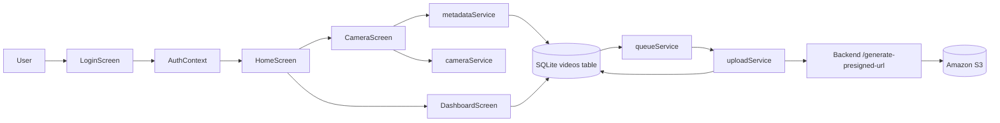

# VideoCaptureSystem

Android-only React Native CLI app for secure video capture, local metadata storage, resilient upload queuing, and direct S3 delivery through presigned URLs.

## What This Repo Contains

- `src/`: Android app written in TypeScript
- `backend/`: Express + TypeScript presign service
- `android/`: native Android project configured for API 29+

## Architecture



## Core Flow

1. User logs in with the mock credentials.
2. CameraScreen records video and saves the file locally.
3. MetadataService captures file size, device, battery, GPS, and network details.
4. The recording is inserted into SQLite with `upload_state = pending`.
5. QueueService resumes pending uploads on app start and during foreground activity.
6. UploadService requests a presigned URL from the backend and uploads the file directly to S3.
7. DashboardScreen shows the current status and lets the user retry or delete.

## Folder Structure

```text
src/
  components/
  config/
  constants/
  db/
  hooks/
  models/
  screens/
  services/
  types/
  utils/
backend/
  src/
    controllers/
    routes/
    services/
    config/
```

## Prerequisites

- Node.js 22+
- Android SDK with API 29 or newer
- Android emulator or physical Android device
- Java 17 compatible toolchain

## Install Dependencies

From the app root:

```sh
npm install
```

From the backend folder:

```sh
cd backend
npm install
```

## Run Android

Start Metro:

```sh
npm start
```

In a second terminal, build and launch Android:

```sh
npm run android
```

## Run Backend

In the backend folder:

```sh
npm run dev
```

For production-style execution:

```sh
npm run build
npm start
```

## Environment

Backend `backend/.env`:

```env
PORT=3000
AWS_REGION=your-region-name
S3_BUCKET_NAME=your-bucket-name
PRESIGNED_URL_EXPIRES_IN_SECONDS=900
AWS_ACCESS_KEY_ID=your-access-key
AWS_SECRET_ACCESS_KEY=your-secret-key
AWS_SESSION_TOKEN=optional-session-token
```

Android emulator networking uses `http://10.0.2.2:3000` for the backend base URL. On a physical device, use your machine's LAN IP instead.

## Testing

Run app tests:

```sh
npm test
```

Run TypeScript checks:

```sh
npx tsc --noEmit
```

Backend build:

```sh
cd backend
npm run build
```

## Notes

- The app is intentionally Android-only.
- `react-native-gesture-handler`, `react-native-screens`, and `react-native-safe-area-context` are already wired in.
- Mock auth uses `admin@test.com` / `123456`.
- Session state is stored securely with `react-native-encrypted-storage`.
- Camera recordings stop automatically at 60 seconds.
- Uploads are queued locally in SQLite and retried with exponential backoff.
- See `INFRA.md` for the database schema, retry design, S3 layout, IAM policy, and scaling notes.
